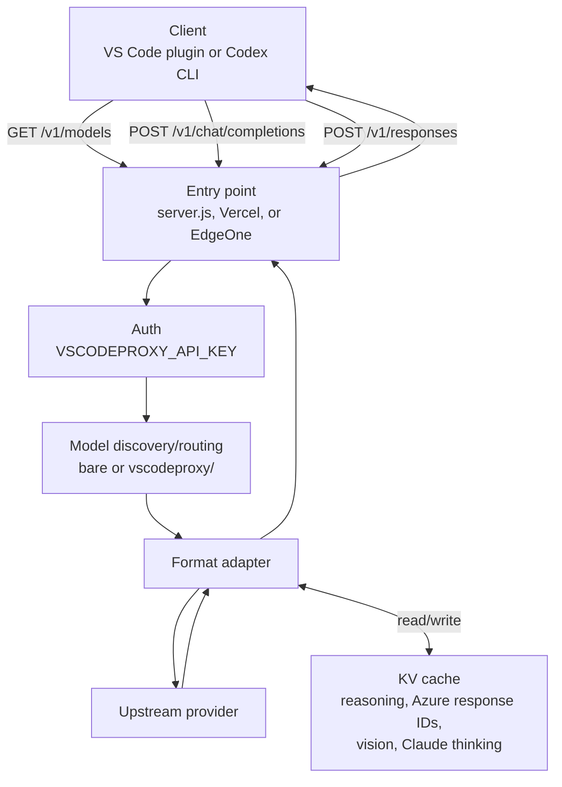

# Architecture Overview

vscodeProxy exposes an OpenAI-compatible `/v1` surface for two client families:

- **Chat Completions clients:** VS Code OAI/Copilot-compatible plugins call `/v1/chat/completions`.
- **Responses clients:** Codex CLI calls `/v1/responses`.

The proxy resolves the requested model to a provider, normalizes the request only as much as that provider requires, and returns the same public API shape the client requested.

## Request Flow

## Provider Routing

| Model shape | Provider |
|---|---|
| `gpt-*`, `o*`, `gpt-general` | Azure OpenAI |
| `claude-*` | Azure Anthropic |
| `deepseek-*` | DeepSeek |
| `kimi-*` | Kimi |
| `minimax-*` | MiniMax |

Prefixes are stripped before routing:

- `vscodeproxy/gpt-5.5`
- `azure/gpt-5.5`

The response model follows the client request form when possible. For example, `vscodeproxy/gpt-general` remains `vscodeproxy/gpt-general` in the response.

## Public API Modes

| Public path | Primary client | Upstream behavior |
|---|---|---|
| `/v1/models` | All clients | Returns bare and `vscodeproxy/` IDs from `VSCODEPROXY_MODELS` |
| `/v1/chat/completions` | VS Code OAI plugins | For Azure OpenAI, converts Chat Completions to Azure Responses and maps output back to Chat Completions |
| `/v1/responses` | Codex CLI | For Azure OpenAI, preserves Responses-shaped JSON/SSE |

`/v1/responses` is intentionally Azure OpenAI-only for now. Use Chat Completions mode for DeepSeek, Kimi, MiniMax, and Azure Anthropic.

## Runtime Entry Points

| Runtime | Entry |
|---|---|
| Docker / local Node | `server.js` |
| Vercel Edge | `api/proxy.js` via `vercel.json` rewrites |
| EdgeOne Pages | `cloud-functions/v1/[[default]].js` and provider-specific legacy routes |

## Key Modules

| File | Role |
|---|---|
| `api/proxy.js` | Main request handler, routing, auth, upstream fetch, streaming |
| `api/models.js` | Model prefix parsing, discovery, alias handling |
| `api/azure-openai.js` | Azure Responses normalization and Chat Completions mapping |
| `api/azure-anthropic.js` | Anthropic Messages mapping |
| `api/reasoning.js` | Reasoning cache injection/extraction |
| `api/vision-bridge.js` | Image-to-text bridge for text-only providers |
| `api/kv.js` | Redis, Upstash, and EdgeOne KV abstraction |
