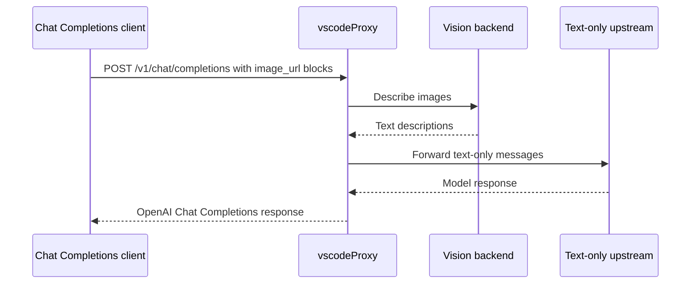

# Vision Bridge

The vision bridge lets text-only chat providers receive useful image context.

It applies to:

- DeepSeek
- MiniMax

It is skipped for:

- Azure OpenAI
- Azure Anthropic
- Kimi

## Flow



## Backends

| Provider | Variables |
|---|---|
| MiniMax VL default | `MINIMAX_API_KEY` |
| OpenAI-compatible vision | `VISION_API_PROVIDER=openai`, `VISION_API_KEY`, optional `VISION_API_URL`, `VISION_MODEL` |

Useful tuning:

```env
VISION_TIMEOUT_MS=15000
VISION_CONCURRENCY=2
```

Set `VISION_TIMEOUT_MS=0` to disable per-image timeout on runtimes without a pre-stream wall-clock limit.

## Allowed Image URL Schemes

By default the vision bridge only forwards `data:` image URIs to the configured backend. Inline base64 payloads from VS Code OAI / Codex are accepted as-is.

`http(s)` URLs that some clients embed (remote screenshots, public CDN links) are **rejected** by default — they would otherwise cause the upstream vision provider (MiniMax / OpenAI) to perform an HTTP fetch on the client's behalf, which can be used to probe networks that the upstream can reach.

To accept remote image URLs:

```env
VISION_ALLOW_REMOTE_URLS=true
```

When enabled, the **literal hostname** in the URL is matched against a static blocklist. Specifically these forms are rejected:

- Loopback `127.0.0.0/8`, `::1`, `localhost` (with or without trailing dot, any subdomain of `.localhost`)
- Link-local `169.254.0.0/16`, `fe80::/10` (this is what catches the cloud metadata endpoint `169.254.169.254` and the various IPv6 wrappers around it)
- RFC1918 `10/8`, `172.16/12`, `192.168/16`
- CGNAT `100.64.0.0/10`
- ULA `fc00::/7`
- Multicast / reserved `224.0.0.0/4`, `ff00::/8`
- IPv6 embeddings of any blocked IPv4: v4-mapped `::ffff:a.b.c.d` (and its Node-normalized hex form `::ffff:HHHH:LLLL`), v4-translated `::ffff:0:a.b.c.d`, IPv4-compatible `::a.b.c.d`, NAT64 well-known `64:ff9b::/96` (RFC 6052), and 6to4 `2002:HHHH:LLLL::/48`. The NAT64 local-use prefix `64:ff9b:1::/48` (RFC 8215) is blocked as a whole literal prefix — by design any address in that prefix is translated to some IPv4 inside the operator's network, so we do not try to decode the RFC 6052 §2.2 /48 split (which spreads the IPv4 across `hex[3..5]` around a reserved `u` byte and which translators are required to read while ignoring the suffix bits)
- Any IPv6 hostname that fails to parse (refused conservatively)

### What this filter does NOT do

The check runs against the URL's hostname **as a string** before the request is handed off to the upstream vision provider. It does not resolve DNS, it does not pre-fetch the URL, and it does not inspect HTTP redirects. The actual image fetch is performed by the upstream provider on its own network, which the proxy has no control over.

That means a determined attacker can still cause the upstream backend to reach a private address via:

- A public DNS name (e.g. `metadata.attacker.example`) with an `A`/`AAAA` record pointing at `169.254.169.254` or any RFC1918 host that the upstream can reach
- A public URL that returns `30x` to such an address
- Internal hostnames known to the upstream provider but not to this proxy

If your threat model requires defense against these, **leave `VISION_ALLOW_REMOTE_URLS=false`** and have clients (or an external sidecar you control) fetch, DNS-validate, redirect-validate, and inline images as `data:` URIs before sending them to vscodeProxy. Edge-runtime targets like Vercel Edge do not expose the resolved socket IP or a redirect-blocking `fetch` option, so we cannot enforce this guarantee in-process.

## Error Behavior

For a non-streaming request, vscodeProxy distinguishes two whole-batch failure modes so the client gets the right HTTP status:

- **All images rejected by validation** (unsupported scheme, blocked host) → `400 unsupported_image_url`. This is a request / configuration problem; fix the URL, inline as `data:`, or set `VISION_ALLOW_REMOTE_URLS=true`.
- **All images failed in the upstream vision provider** (timeout, auth, oversize, etc.) → `502 vision_unavailable`. This is an operational problem; check the configured vision backend.

For **streaming requests**, and for **mixed** non-streaming requests where at least one image was converted successfully, each rejected or failed image is replaced inline with `(image attachment unavailable: …)` so the rest of the prompt still reaches the model.

## Responses Endpoint

The vision bridge is only for Chat Completions requests. `/v1/responses` currently routes to Azure OpenAI, which can handle native multimodal Responses inputs according to the configured Azure model.
