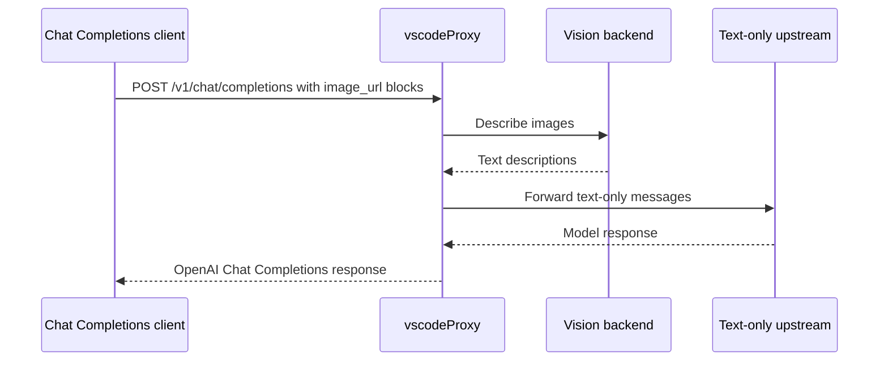

# Vision Bridge

The vision bridge lets text-only chat providers receive useful image context.

It applies to:

- DeepSeek
- MiniMax

It is skipped for:

- Azure OpenAI
- Azure Anthropic
- Kimi

## Flow



## Backends

| Provider | Variables |
|---|---|
| MiniMax VL default | `MINIMAX_API_KEY` |
| OpenAI-compatible vision | `VISION_API_PROVIDER=openai`, `VISION_API_KEY`, optional `VISION_API_URL`, `VISION_MODEL` |

Useful tuning:

```env
VISION_TIMEOUT_MS=15000
VISION_CONCURRENCY=2
```

Set `VISION_TIMEOUT_MS=0` to disable per-image timeout on runtimes without a pre-stream wall-clock limit.

## Error Behavior

If every image conversion fails for a non-streaming request, vscodeProxy returns a clear upstream error instead of forwarding ignored image blocks to a text-only model.

For streaming requests, failed image conversions are represented with placeholder text so the stream can still begin.

## Responses Endpoint

The vision bridge is only for Chat Completions requests. `/v1/responses` currently routes to Azure OpenAI, which can handle native multimodal Responses inputs according to the configured Azure model.
