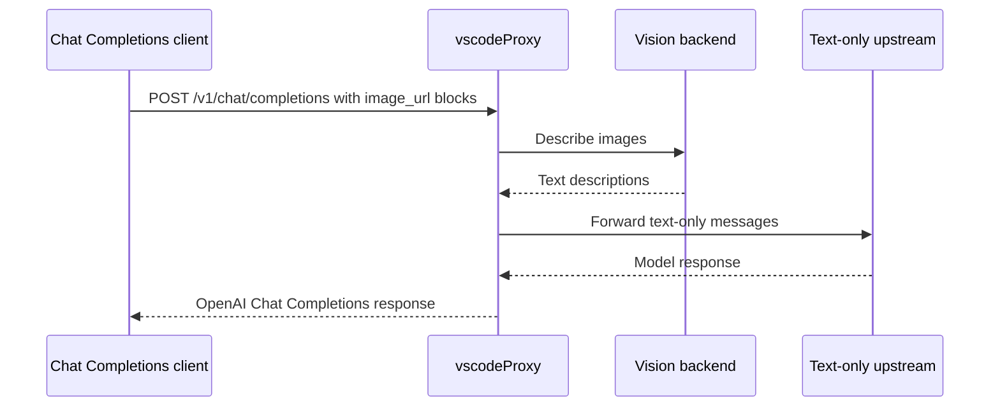

# Vision Bridge

The vision bridge lets text-only chat providers receive useful image context.

It applies to:

- DeepSeek
- MiniMax

It is skipped for:

- Azure OpenAI
- Azure Anthropic
- Kimi

## Flow



## Backends

| Provider | Variables |
|---|---|
| MiniMax VL default | `MINIMAX_API_KEY` |
| OpenAI-compatible vision | `VISION_API_PROVIDER=openai`, `VISION_API_KEY`, optional `VISION_API_URL`, `VISION_MODEL` |

Useful tuning:

```env
VISION_TIMEOUT_MS=15000
VISION_CONCURRENCY=2
```

Set `VISION_TIMEOUT_MS=0` to disable per-image timeout on runtimes without a pre-stream wall-clock limit.

## Allowed Image URL Schemes

By default the vision bridge only forwards `data:` image URIs to the configured backend. Inline base64 payloads from VS Code OAI / Codex are accepted as-is.

`http(s)` URLs that some clients embed (remote screenshots, public CDN links) are **rejected** by default — they would otherwise cause the upstream vision provider (MiniMax / OpenAI) to perform an HTTP fetch on the client's behalf, which can be used to probe networks that the upstream can reach.

To accept remote image URLs:

```env
VISION_ALLOW_REMOTE_URLS=true
```

Even with this enabled, hostnames resolving to the following ranges are still rejected:

- Loopback `127.0.0.0/8`, `::1`, `localhost` (with or without trailing dot, any subdomain of `.localhost`)
- Link-local `169.254.0.0/16`, `fe80::/10` (this is what catches the cloud metadata endpoint `169.254.169.254` and the various IPv6 wrappers around it)
- RFC1918 `10/8`, `172.16/12`, `192.168/16`
- CGNAT `100.64.0.0/10`
- ULA `fc00::/7`
- Multicast / reserved `224.0.0.0/4`, `ff00::/8`
- IPv6 embeddings of any blocked IPv4: v4-mapped `::ffff:a.b.c.d` (and its Node-normalized hex form `::ffff:HHHH:LLLL`), v4-translated `::ffff:0:a.b.c.d`, IPv4-compatible `::a.b.c.d`, NAT64 `64:ff9b::a.b.c.d`, and 6to4 `2002:HHHH:LLLL::/48`
- Any IPv6 hostname that fails to parse (refused conservatively)

## Error Behavior

For a non-streaming request, vscodeProxy distinguishes two whole-batch failure modes so the client gets the right HTTP status:

- **All images rejected by validation** (unsupported scheme, blocked host) → `400 unsupported_image_url`. This is a request / configuration problem; fix the URL, inline as `data:`, or set `VISION_ALLOW_REMOTE_URLS=true`.
- **All images failed in the upstream vision provider** (timeout, auth, oversize, etc.) → `502 vision_unavailable`. This is an operational problem; check the configured vision backend.

For **streaming requests**, and for **mixed** non-streaming requests where at least one image was converted successfully, each rejected or failed image is replaced inline with `(image attachment unavailable: …)` so the rest of the prompt still reaches the model.

## Responses Endpoint

The vision bridge is only for Chat Completions requests. `/v1/responses` currently routes to Azure OpenAI, which can handle native multimodal Responses inputs according to the configured Azure model.
